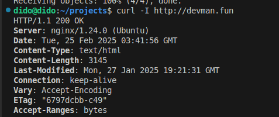

# securing_nginx

## Install nginx
```

sudo apt update-rc.d nginx defaults

```

### Nginx puts out a lot of information about the system its running on and the version.So limit it





This can be limited. To do this have to edit `nginx.conf`
```

sudo nano /etc/nginx/nginx.conf

```
nginx.conf

```

http {
    ##
    # Basic Settings
    ##

    server_tokens off;
    
}

```

#### reload the server 

`sudo systemctl reolad nginx`

### Hide the 403 and 401 errors

```

expose_php =Off

```
Hide them if you are using virtual hosting by the nginx 
```

$ sudo nano /etx/nginx/sites-enabled/default 
    server {

        ...
        error_page 401 403 404 /404.html

```

#### reload the server

### Add IP restrictions to your web server.
To restrict the access to your IP open the configuration file and use this server block
`$ sudo nano /etc/nginx/sites-enabled/default`
```

server {
    location / {
        allow 173.54.4.21/24;
        deny all;

    }
}

```

